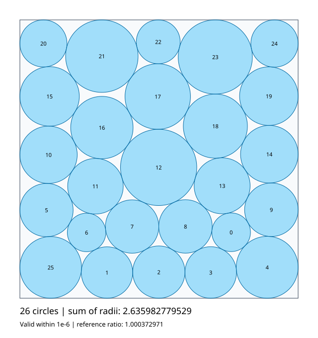

# Circle packing with the C++ runner

Pack exactly 26 circles in the unit square and maximize the sum of their radii.
The evolution loop runs in C++; candidate programs and their geometric evaluator
run in Python. No Python OpenEvolve package is required.

`initial_program.py` preserves the original OpenEvolve construction: a center,
two rings, clipping to the square, and sequential radius shrinking. In
particular, its final initially zero center is still clipped to `(0.01, 0.01)`.
The migration removes interactive plotting and does not substitute the upstream
best program. A direct baseline check measured:

| Metric | Measured baseline |
| --- | ---: |
| Validity | 1 |
| Sum of radii | 0.9597642169962064 |
| Sum / 2.635 | 0.36423689449571406 |
| Maximum boundary violation | 0 |
| Maximum pair overlap | 2.7755575615628914e-17 |

The number `2.635` is the reference benchmark used by the upstream example. It
is not a proven optimum, a score achieved by this baseline, or a promise that a
short run will reach it.

## Measured two-iteration run

A real run of the C++ CLI with the installed Codex CLI generated two candidates
on 2026-09-29. Both were accepted by the geometric evaluator:

| Program | Sum of radii | Evaluation time |
| --- | ---: | ---: |
| Original baseline | 0.9597642169962064 | 0.003 s |
| Iteration 1 | 2.625219033765203 | 12.708 s |
| Iteration 2 | 2.63598277952934 | 4.844 s |

The generated [best program](results/best_program.py) is saved with its actual
[geometry](results/packing.json), [metrics](results/metrics.json),
[constraint diagnostics](results/validation.json), and [SVG](results/packing.svg).
It is the new output of this run, not the upstream example's best program. The
full [run summary](results/run_summary.json) records both live iterations, three
fresh-process rechecks, environment versions, and source SHA-256 hashes. The
Codex CLI chose its default model; the model identity was **not pinned**.
The summary preserves the provider value and configuration hash from that run.
The current configuration uses `provider: codex`; at the time of the recorded run
the provider was named `codex_cli`.

Three independent reruns of the saved program returned exactly identical
centers, radii, and sums on this machine. Their complete process wall times were
4.818 s, 5.045 s, and 5.155 s, each under an external 65-second timeout. A separate
calculation using only Python's standard-library `math.fsum` and `math.hypot`
checked all 26 circles, 104 boundary constraints, and 325 pairs from the saved
JSON. The sum was **2.63598277952934**, with minimum boundary clearance
**1.990150808039992e-8** and minimum pair clearance
**8.757936403869238e-9**. All radii were positive, and both clearances were
positive without using the evaluator's tolerance.



This exceeds the rounded reference value 2.635; it does not establish an
optimum. Two model iterations and three rechecks are a small engineering trial,
not a statistical reliability study. The generated optimizer has a fixed RNG
seed but also a wall-clock search budget (up to 49 seconds inside `run_packing`,
capped at 52 seconds since module initialization). Platform, load, SciPy/NumPy,
and BLAS differences can change its search trajectory or how many attempts
finish. These checks used macOS arm64, Python 3.13.9, NumPy 2.3.5, SciPy 1.16.3,
and Codex CLI 0.155.1.

Recheck the preserved run output without making a model call:

```sh
"$PACKING_PYTHON" examples/circle_packing/check_packing.py \
  examples/circle_packing/results/best_program.py \
  --output build/circle_packing_recorded_recheck
```

## Build and Python setup

Run these commands from the repository root:

```sh
cmake -S . -B build -DCMAKE_BUILD_TYPE=Debug
cmake --build build -j 8
export PACKING_PYTHON=python3
"$PACKING_PYTHON" -m pip install -r examples/circle_packing/requirements.txt
# Optional: allow evolved programs to use numerical optimization.
"$PACKING_PYTHON" -m pip install scipy
```

Select a Python 3.9+ executable with NumPy installed. On the development machine,
`/Users/app/anaconda3/bin/python3.13` already has NumPy and SciPy; the default
Homebrew Python does not. The checker writes SVG directly and needs neither
Matplotlib nor a graphical display.

## Baseline and model runs

All runtime settings live in `examples/circle_packing/config.yaml`. Set
`run.python_executable` to the Python with NumPy installed (the `$PACKING_PYTHON`
variable above is only for setup and standalone checks). Paths in `run` are
relative to the YAML file, so the example's `../../build/packing` output directory
is `build/packing` at the repository root.

For a baseline, change `max_iterations` to `0`. This evaluates the initial
program, saves the baseline and checkpoint, and makes no model call:

```sh
build/ievolve/bin/ievolve --config examples/circle_packing/config.yaml
# Equivalent wrapper; builds the binary if it is missing:
./run_example.sh
```

For evolution, set `max_iterations` to the desired number of attempts and use
a fresh `run.output_directory`, or set `run.checkpoint` to resume. The checked-in
configuration requests three iterations, medium reasoning effort, a 300-second
model timeout, and no model retries. Each candidate has a 60-second evaluator
timeout and no evaluator retry. Candidate generation asks for a complete Python
replacement and needs no model tools.

The default model entry uses `provider: codex` and omits `name` to select the
installed authenticated Codex CLI's default model. Set `name` in that same
`llm.models` entry to pin a model, or change its `provider` to `claude_code` for
Claude Code. A model run can consume the selected account's usage allowance.
A few valid improvements demonstrate the pipeline, not convergence.

To continue from checkpoint 3, set these fields in the same YAML file:

```yaml
run:
  evaluation_file: evaluator.py
  output_directory: ../../build/packing
  python_executable: python3  # select the Python with NumPy installed
  checkpoint: ../../build/packing/checkpoints/checkpoint_3
max_iterations: 3            # additional attempts on resume
```

Retain the other algorithm settings. The initial program is not needed on
resume. Run the same `ievolve --config ...` command. If you copy the YAML to
another directory, adjust its relative paths; the wrapper also accepts
`./run_example.sh --config path/to/config.yaml`.

The wrapper uses the configuration exactly as written. It no longer accepts
iteration/provider/output overrides, reads `IEVOLVE_PYTHON`, deletes earlier
output, or automatically verifies the geometry. Rechecking remains available
through the standalone command below.

## Recheck and visualize actual geometry

Re-execute a saved program and independently recompute its score:

```sh
"$PACKING_PYTHON" examples/circle_packing/check_packing.py \
  build/packing/best/best_program.py \
  --output build/circle_packing_check
```

Omit the program argument to check the initial baseline. The checker prints
machine-readable metrics to stdout and writes `metrics.json`, `packing.json`,
`validation.json`, and, for a valid packing, `packing.svg`. Its exit status is
zero for a valid packing and one for an invalid packing. Candidate stdout is
redirected to stderr. The standalone checker has no process timeout; use the
C++ runner to enforce a deadline when executing an unknown or expensive
candidate. A saved geometry artifact can be checked without running code:

```sh
"$PACKING_PYTHON" examples/circle_packing/check_packing.py \
  --packing-json build/circle_packing_check/packing.json \
  --output build/circle_packing_recheck
```

The plot is a diagnostic view; the numeric constraints determine validity.

## Evaluation contract and limits

Candidates define `run_packing()` and return `(centers, radii, reported_sum)`.
Centers must have exactly shape `(26, 2)` and radii exactly `(26,)`; real numeric
lists are accepted too. All coordinates and radii must be finite, and every
radius must be nonnegative. Zero-radius circles are allowed, as in the original
example.

For every circle, `x-r`, `y-r`, `1-x-r`, and `1-y-r` must be at least `-1e-12`.
For every pair, the Euclidean center distance minus both radii must be at least
`-1e-12`. This absolute tolerance is in unit-square coordinates and only absorbs
float64 rounding in the residual arithmetic (about `1e-16`), so tangent circles
are accepted while enlarging radii into the tolerance gains at most about
`1e-11`; it is not an exact geometric proof. Diagnostics
include every boundary and pair residual, the worst circle/side and pair,
violation counts, and the actual sum. Positive residuals mean clearance.

The evaluator recomputes the sum from the returned radii with `math.fsum`.
`reported_sum` is retained only as a diagnostic, so spoofing it cannot raise a
score. For valid geometry, `sum_radii` and `combined_score` are the actual sum
and `target_ratio` is `sum_radii / 2.635`. Invalid geometry receives zero for
these scores; its finite actual sum is retained separately where available.
Malformed imports, return values, or geometry produce diagnostic artifacts.

The evaluator returns a plain object with `metrics` and text `artifacts`, not an
OpenEvolve class. The existing C++ worker owns the single process timeout,
including Python imports. There are no nested subprocesses, temporary runner
scripts, or pickle files. That process boundary controls lifecycle; it is not
a security sandbox. Candidates and evaluator execute in the same Python
process, so this example checks ordinary generated numerical programs, not
deliberate attempts to tamper with the evaluator.

One execution checks feasibility and score. It cannot establish optimality,
statistical reliability, or repeatability of stochastic candidates. The prompt
requests deterministic seeds; repeat independent checks for any result you
intend to rely on. A timeout or rejected model response also does not establish
that the mathematical approach was poor.

## Offline tests and attribution

```sh
"$PACKING_PYTHON" -m unittest discover -s examples/circle_packing -p '*_test.py' -v
```

The tests cover shapes/counts, NaN/infinity, negative radii, all boundaries,
overlap, tolerance, overflow, spoofed sums, candidate errors, JSON artifacts,
and the headless SVG check.

The initial construction is adapted from
`openevolve/examples/circle_packing/initial_program.py`, distributed by the
OpenEvolve contributors under the Apache License 2.0. Its modification notice
is in the source; the license is included in [LICENSE](LICENSE). The evaluator
implements the same geometric problem with stricter input validation and a
different execution/artifact interface. Historical upstream optimization
results are not presented as results of this migration.
